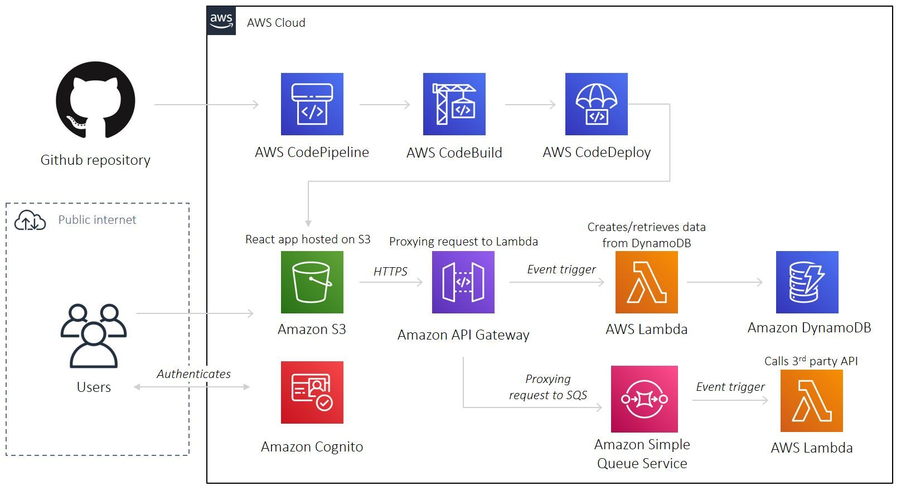

# AWS Serverless React App

A reference project to deploy a serverless, full-stack React app onto AWS with Terraform. Inspired by [this](https://www.youtube.com/watch?v=Bro0uFVDrWY) YouTube tutorial by Code Engine

A to-do list app which allows users to create, and read to-do's from DynamoDB

App URL [`https://www.reactserverless.co.uk`](https://www.reactserverless.co.uk)



## Pre-requisite

- Make sure you have installed [Terraform](https://learn.hashicorp.com/tutorials/terraform/install-cli), [AWS CLI](https://docs.aws.amazon.com/cli/latest/userguide/install-cliv2-mac.html#cliv2-mac-prereq), and configured a `default` AWS CLI profile (see doc [here](https://docs.aws.amazon.com/cli/latest/userguide/cli-configure-quickstart.html#cli-configure-quickstart-profiles))

```bash
terraform -help # prints Terraform options
which aws # prints /usr/local/bin/aws
aws --version # prints aws-cli/2.0.36 Python/3.7.4 Darwin/18.7.0 botocore/2.0.0
aws configure # configure your AWS CLI profile
```

## Configuration

- Create a Github project, and generate a personal access token (see doc [here](https://docs.github.com/en/github/authenticating-to-github/creating-a-personal-access-token))

- Create an [S3 bucket](https://www.terraform.io/docs/language/settings/backends/s3.html) to store Terraform state. Populate bucket name in `01-main.tf`

- Populate `terraform.tfvars`:

```bash
default_region      = "<YOUR_AWS_DEFAULT_REGION>"
github_username     = "<YOUR_GITHUB_USERNAME>"
github_project_name = "<YOUR_GITHUB_PROJECT_NAME>"
app_name            = "<GIVE_YOUR_APP_A_NAME!>"
environment         = "<ENVIRONMENT_NAME>"
```

## Deploy

```bash
cd deploy # change to deploy directory
terraform init # initialises Terraform
terraform apply # deploys AWS stack. See output for app url
terraform destroy # destroys AWS stack
```

- When prompted for `github_token`, provide the value and hit Return. Alternatively, create a [local environment variable](https://www.terraform.io/docs/language/values/variables.html#environment-variables) named `TF_VAR_github_token`

## Run app locally

- Run `terraform output` to print AWS resources URL/IDs
- Update `src/conf/config.js` with the associated AWS resources URL/IDs

```bash
npm install # installs Node dependencies
yarn start # visit app at http://localhost:3000/
```

## Hosting website securely on AWS with a valid SSL certificate

- Purchase a domain name on [Amazon Route 53](https://aws.amazon.com/route53/)
- Create an email address for your Route 53 custom domain. Set-up rule to forward emails to `admin@<your_custom_domain>` to your personal email address. See tutorial [here](https://medium.com/responsetap-engineering/easily-create-email-addresses-for-your-route53-custom-domain-589d099dd0f2)
- Add an MX record for your domain. See documentation [here](https://docs.aws.amazon.com/ses/latest/DeveloperGuide/receiving-email-mx-record.html)
- Approve email validation requests from [AWS Certificate Manager](https://docs.aws.amazon.com/acm/latest/userguide/email-validation.html)
- Add two DNS A records to point `<your_custom_domain>`, and `www.<your_custom_domain>` to the associated CloudFront distirubtions. See reference documentation [here](https://docs.aws.amazon.com/Route53/latest/DeveloperGuide/resource-record-sets-creating.html)
- Invalidate CloudFront cache on content updates. See tutorial [here](https://www.alexhyett.com/terraform-s3-static-website-hosting/)

## Contributing

Pull requests are welcome. For major changes, please open an issue first to discuss what you would like to change.

Please make sure to update tests as appropriate.

If you find this project helpful, please give a :star: or even better buy me a coffee :coffee: :point_down: because I'm a caffeine addict :sweat_smile:

<a href="https://www.buymeacoffee.com/matlau" target="_blank"></a>

## License

[MIT](https://choosealicense.com/licenses/mit/)
